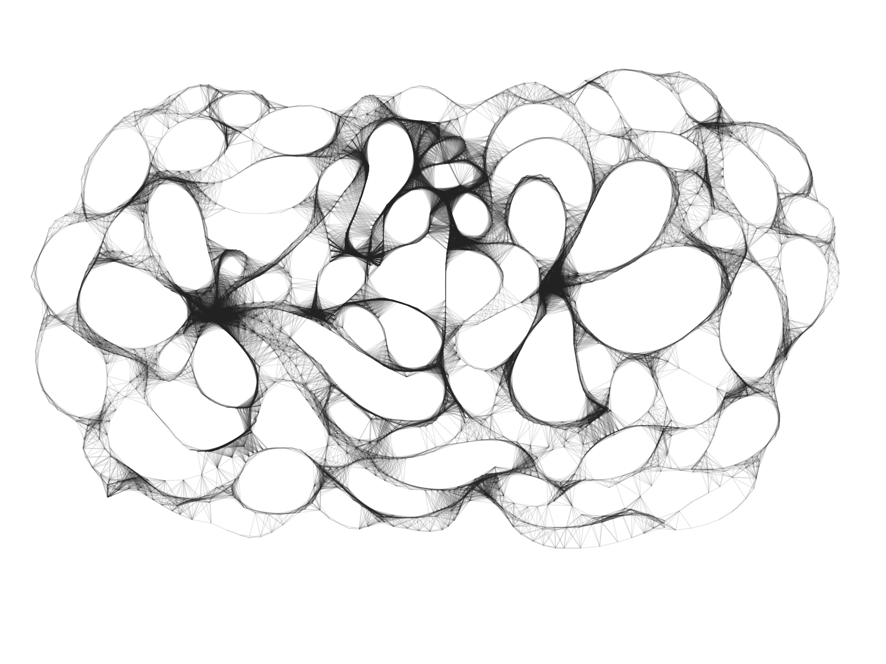
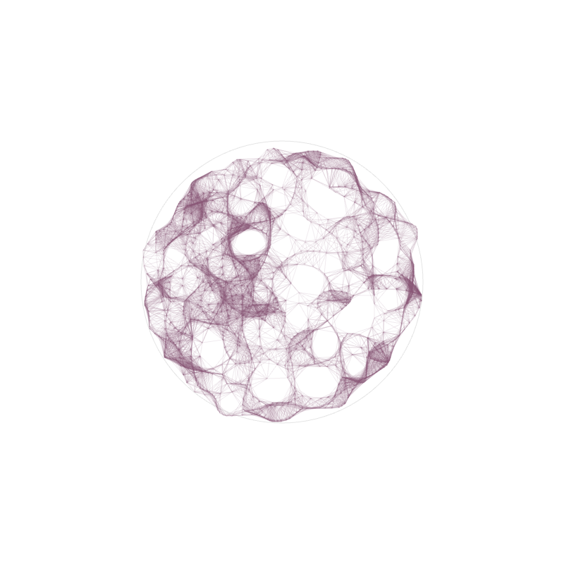
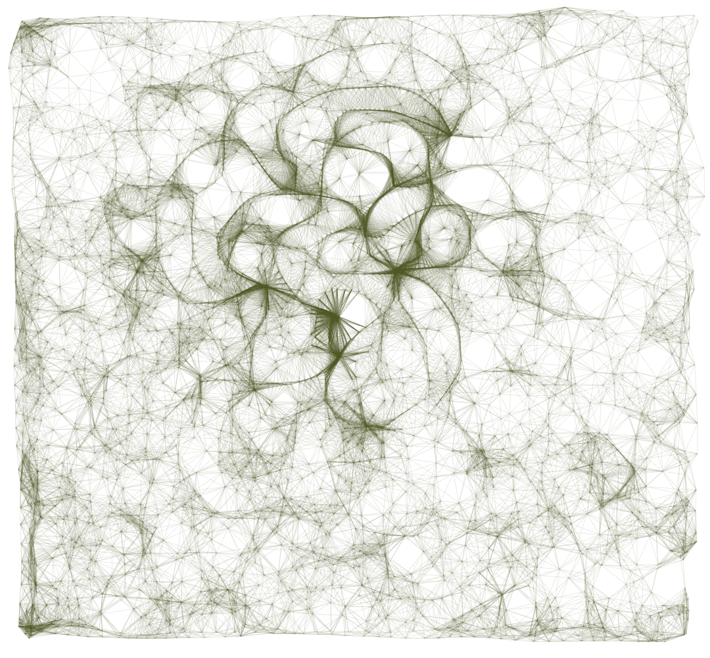
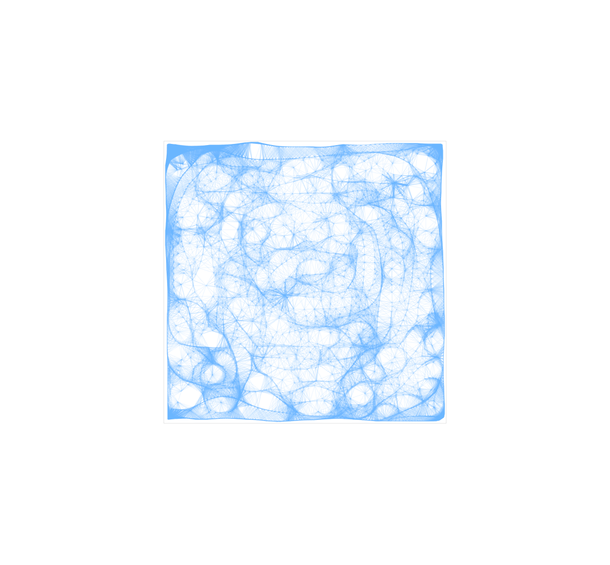

# linework

Hi ! 

This series of experimental digital brushes are made with openFrameworks. They are essentially proof-of-concept miniature projects; through these explorations I have gained knowledge of some fundamental C++ concepts such as dynamic memory allocation, vector behavior and pointers/references. This is an on-going series, the more I learn the more complex the graphics become, so stay tuned ;)

Some examples :

