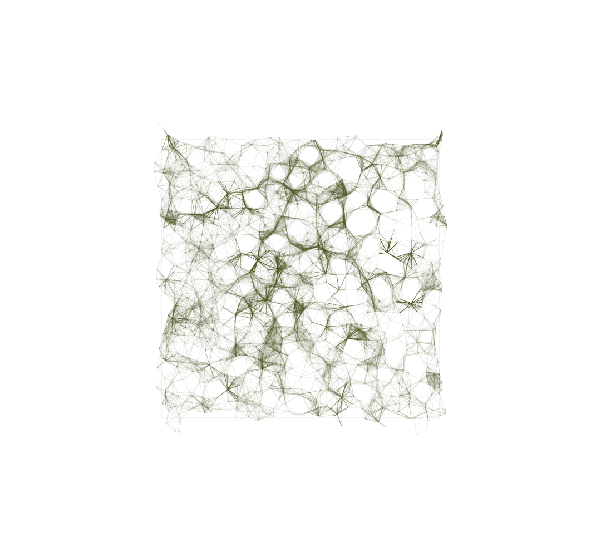

# linework

This series of experimental digital brushes are made with openFrameworks. They are essentially proof-of-concept miniature projects. Through these explorations I have gained knowledge of fundamental C++ concepts such as dynamic memory allocation, vector behavior and pointers/references for example. So stay tuned because this is a work in progress.

Some examples :

